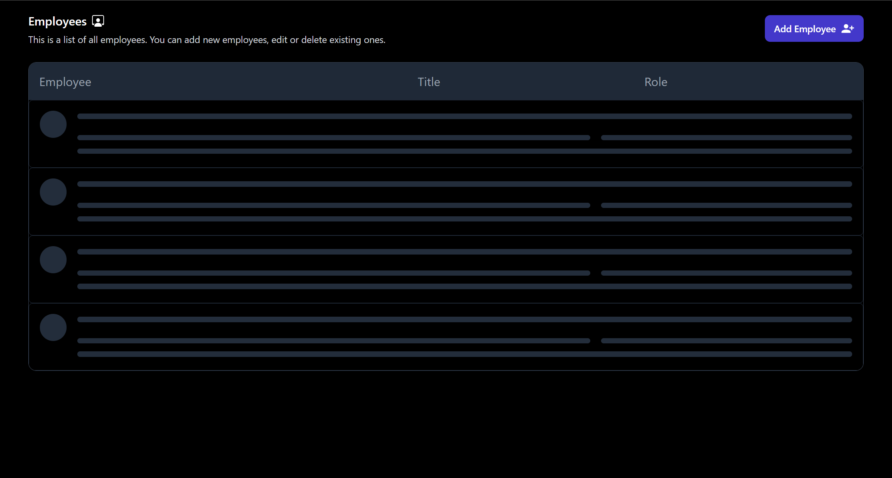
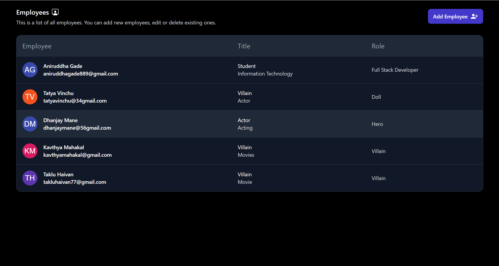

# Employee Entry Website 👥💼

# Live link 🌍📡 - https://employee-entry.netlify.app/ 

# Employee Entry Website 👥💼

Welcome to the Employee Entry Website repository! This project empowers employees to easily fill out and submit their information through a user-friendly form. The submitted data is securely stored in a MongoDB database. The website boasts two key pages: the dynamic homepage, showcasing all submitted employee data, and the intuitive form-filling page.

## 🛠️ Technologies Used

- **Backend:** Express.js 💻
- **Frontend:** Vite + React.js ⚛️
- **Styling:** Tailwind CSS 🎨
- **Database:** MongoDB Atlas  📊
- **API Testing:** Postman  🧪
- **Database Testing:** MongoDB Compass 🧭
- **Deployment:** Netlify for frontend deployment🚀

## ✨ Features

- ♻️ **Single Page Application**: Enjoy a seamless browsing experience with React's single page application architecture.
- ✅ **Form Validation**: Receive instant feedback and error messages when filling out the form, guiding for correct and complete information.
- 📝 **Effortless Form Filling:** Seamlessly input your details on our user-friendly form filling page.
- ⏳ **Loading Sleleton:** As soon as data is being fetched, a loading skeleton will be displayed on the page to enhance the user experience.
- 🚀 **Streamlined Data Collection:** Your form data is consolidated into a single object before being sent to the database.
- 🏠 **Homepage Overview:** Get an overview of all submitted employees data on the homepage.
- 🌐 **MongoDB Atlas Integration:** Benefit from robust and scalable cloud database storage using MongoDB Atlas.
- 🔌 **API Endpoints:** Experience smooth data submission and retrieval through our API endpoints.
- 📱 **Responsive Design:** Enjoy a flawless experience on all devices with our responsive design.

## 📂 Pages

- **Homepage**🏠 : On the homepage, you can view a list of all employees' data. Each employee's Name, Email Id, Department, and Role are displayed in a user-friendly table format. There's also a "Add Employee" button that takes you to the form filling page.

- **Form Filling Page** 📝: The form filling page allows you to submit employee data. You can fill in details such as Name, Email Id, Department, and Role. Once you've filled in the required information, you can submit the form, and the data will be sent to the backend server and stored in the database.

##  🖥️ Screen Preview: 

 # HomePage - Loading Skeleton
 

 # HomePage
 

 # Go back 
 

 # Form Validation
 

 # Form
 
